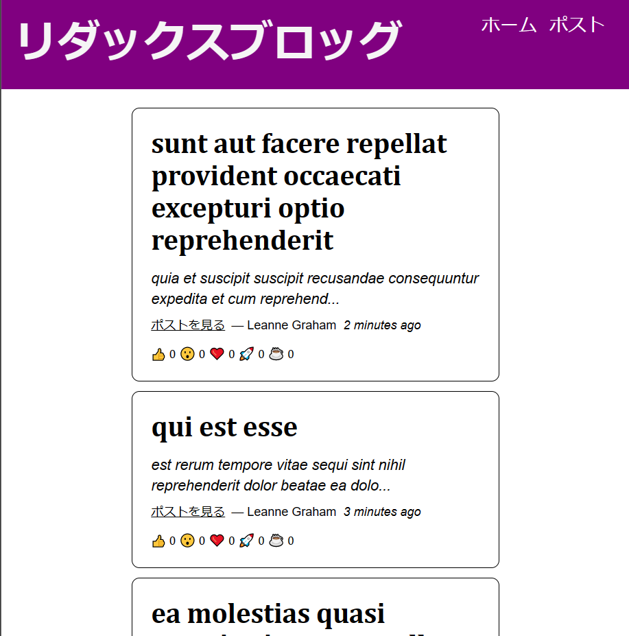
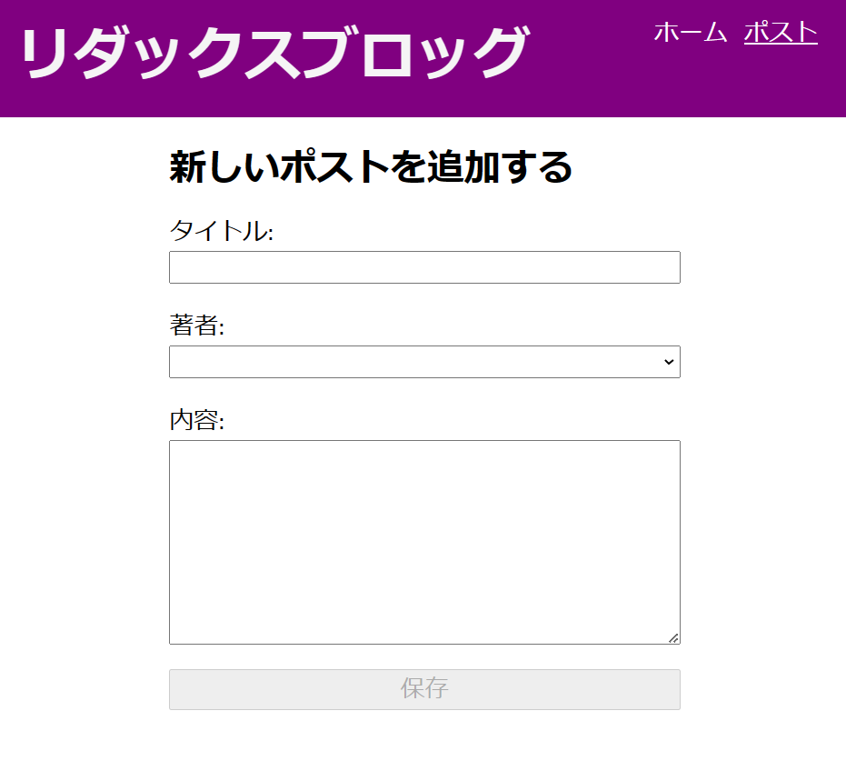
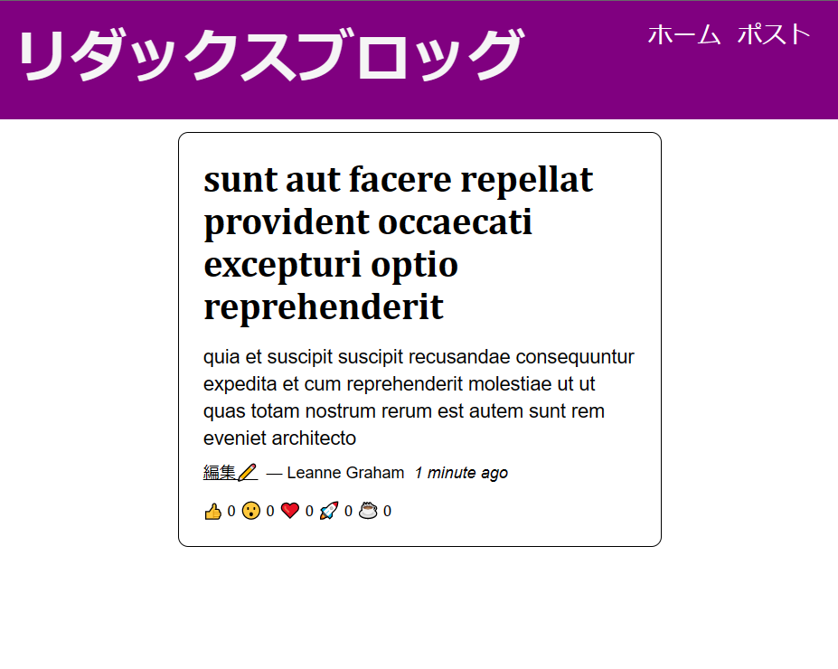
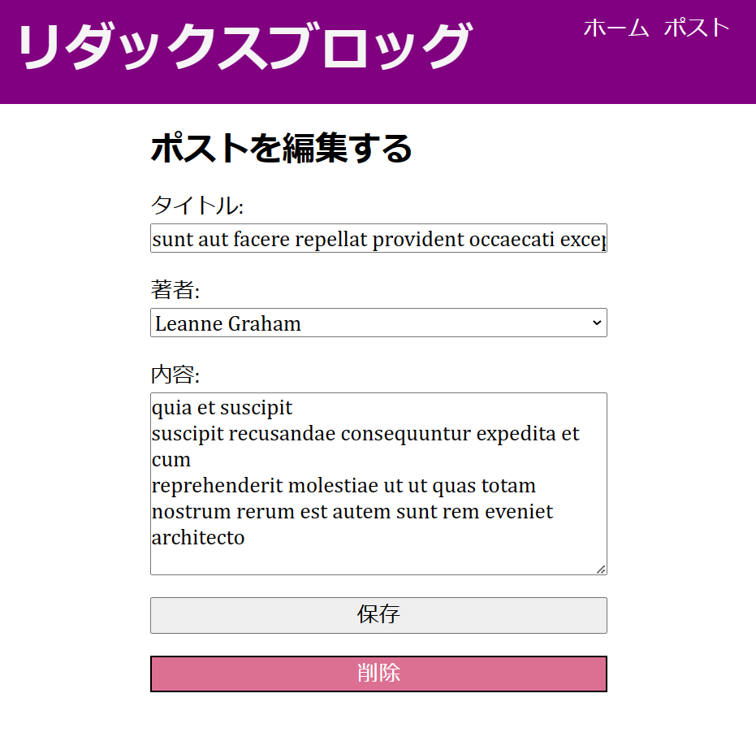

# Chapter 3

This chapter focused on refactoring the previous sample project to support CRUD operations.

For the backend API, we used [JSON Placeholder | A Free fake API for testing and prototyping](https://jsonplaceholder.typicode.com/).

## Home (Posts)

## Add Post

## View Post

## Edit Post

Topics covered:
* React Router
* CRUD Operations
